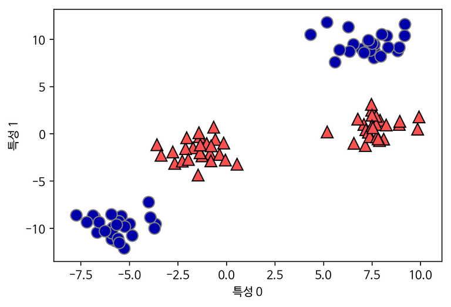
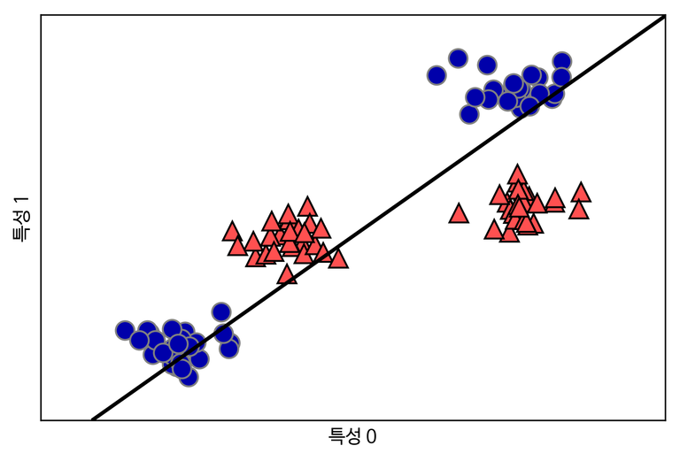
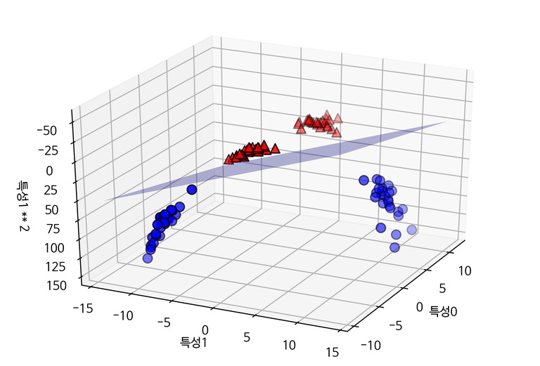
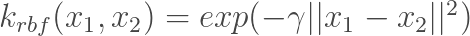
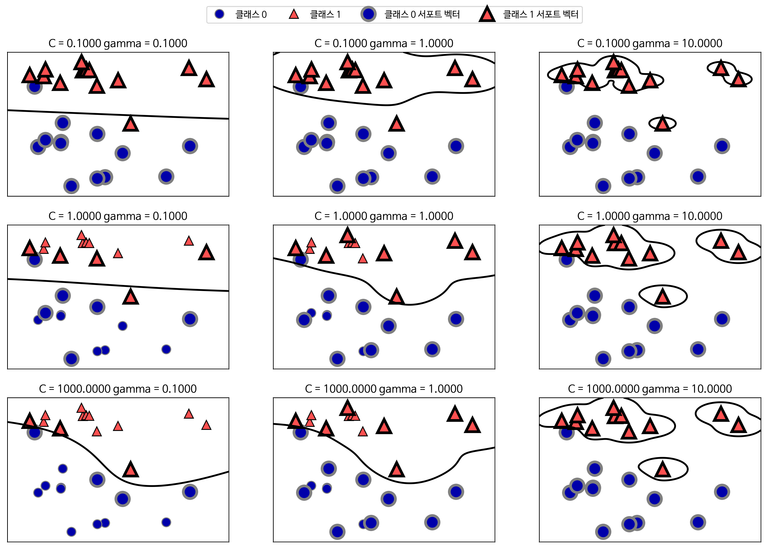
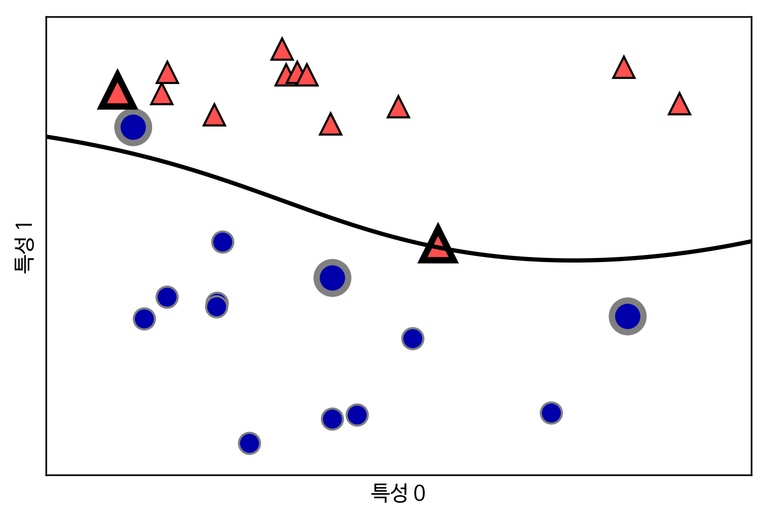

# SVM

# Support Vector Machine

아직까지도 사용하고 있는 classifier model (분류와 회귀에 모두 사용 가능)

- Classification에서는 *Decision Boundary*을 어떻게 구성하는지에 따라 Learning의 성능이 결정됨
    - Sigmoid Function 사용
- 두 클래스 사이의 경계에 위치한 데이터
 포인트들을 Support Vector라고 하고, 이 데이터 포인트를 찾아 최적의 Decision Boundary를 구성
- 장점 : 저차원, 고차원 데이터셋에서 모두 잘 동작
- 단점 : 데이터 샘플이 많은 경우 잘 맞지 않음, 데이터 전처리와 매개변수 설정에 신경을 써야함

## 예제

이진 분류 데이터 셋

# 선형 SVM

선형 SVM을 사용해서 직선으로만 데이터 포인트를 나눈 경우 : 

선형 SVM으로 만들어진 Decision Boundary

뭔가 이상하다? 특성을 추가해서 차원을 확장해보자!

2차원 데이터셋을 3차원으로 확장(비선형 특성을 추가)하여 선형 SVM을 적용하여 만들어진 Decision Boundary

# 커널 기법 (Kernel Trick)

데이터셋에 어떤 특성을 추가해야할지 모를때 사용하는 기법

1. 다항식 커널 : 원래 특성의 가능한 조합을 지정된 차수까지 모두 계산 (다항 균질 커널, 다항 비균질 커널)
2. 가우시안 커널 (예 - RBF 커널) : 모든 차수의 모든 다항식을
 고려 (차원이 무한한 특성 공간에 매핑)

x1, x2 - 데이터 포인트, || x1 - x2 ||는 유클리디안 거리, γ(감마)는 가우시안 커널의 폭을 제어하는 매개 변수

- 작은 감마 값은 가우시안 커널의 반경을 크게 하여 많은 포인트들이 가까이 있는 것으로 고려 됨 (= 데이터 포인트의 영향 범위가 커짐)
- 즉, 작은 감마 값은 Boundary Decision을 천천히 바뀌게 하므로 모델의 복잡도를 낮추고, 큰 감마 값은 그 반대로 더 복잡한 모델을 만듦

# 비선형 SVM

RBF 커널을 사용한 SVM으로 만든 직선이 아닌 Decision Boundary와 Support Vector

# 다중 분류 SVM

1. One vs. One - 각 class를 다른 한 class와 구분하도록 binary classifier model을 학습 N(N-1)/2개 만큼 model이 만들어짐
2. One vs. Rest - 각 class를 다른 모든 class와 구분하도록 binary classifier model을 학습, class의 수만큼 binary classifier model이 만들어지고, 가장 높은 점수를 내는 classifier의 class를 예측값으로 선택

이미지 출처 : https://bit.ly/2OvdGjT