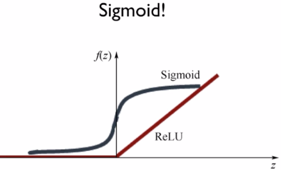
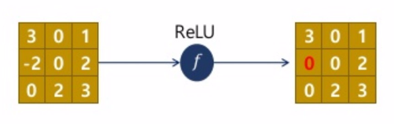
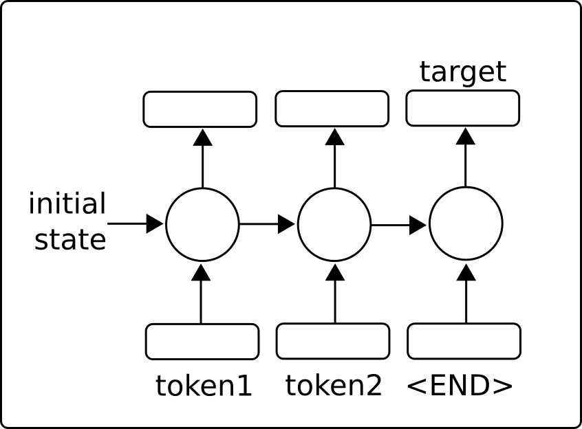
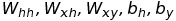
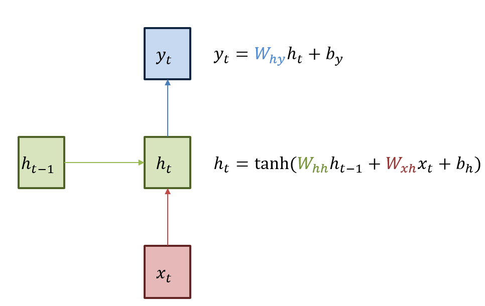
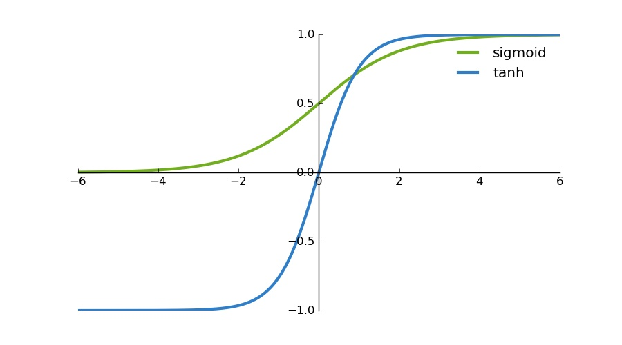
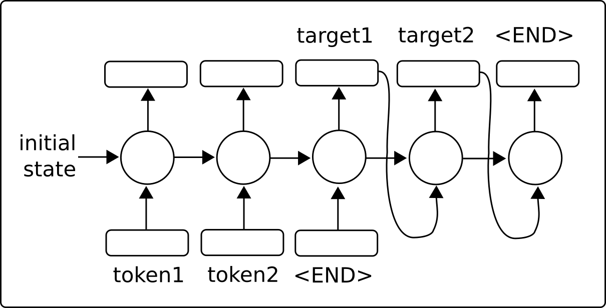
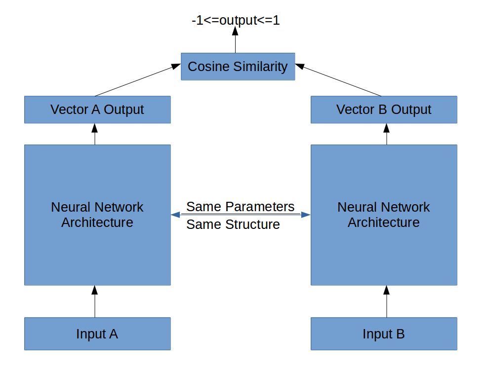

# Chapter 9. 순환 신경망

# Activation Function

- 비유를 하자면, 우리가 사물을 인식하는 과정과 동일

## 1. Sigmoid Function

## 2. ReLU

- ReLu는 Rectified Linear Unit의 약자
- Neural Network 초기에 activation function으로 sigmoid function을 사용했으나 요즘은 ReLU를 주로 사용

## WHY? Gradient Vanishing 문제

1. sigmoid function이 연속이여서 미분 가능한 점과 0과 1사이의 값을 가진다는점, 그리고 0에서 1로 변하는 것이 가파르기 때문에 사용됨.

    그러나 기존에 사용하던 Simgoid function을 ReLu가 대체하게 된 이유는 Gradient Vanishing 문제 때문임.

2. 기존 Gradient 기반의 (가중치에 기반한) method는 parameter value의 작은 변화가 network output에 얼마나 영향을 미칠지를 이해하는 것을 기반으로 parameter value를 학습했음.

    따라서 만약 parameter value의 변화가 network's output의 매우 작은 변화를 야기한다면, 네트워크는 parameter를 효과적으로 학습 시킬 수 없는 문제가 발생.

3. gradient라는 것이 결국 미분값 즉, 변화량을 의미하는데, 이 변화량이 매우 작다면, network 를 효과적으로 학습 시키지 못 함. 

    이 경우 network's output의 gradient는 극도로 작아지게 되는데, 이 경우 초기 레이어에서 parameter value에 대해 큰 변화가 발생해도 output에 대해서 큰 영향을 주지 못 함.

    

    출처 : 김성훈 교수님 lec 10-1

4. sigmoid는 값을 변화시키지만, ReLU 함수는임계값을 넘는 순간 입력을 그대로 넘겨줌.

    즉, 0 이하면 "0"으로 어떤 값이 0 이상이면, 그 값을 그대로 입력하기 때문에 Vanishing Gradient가 해결 되는데, 0 아니면 양수가 출력됨으로써 기울기가 사라지지 않게 되는 것.

    

    출처 : [https://www.slideshare.net/JinwonLee9/ss-70446412](https://www.slideshare.net/JinwonLee9/ss-70446412)

    또한, Gradient가 0 또는 1이면서 함수 자체도 아주 간단해서 Sigmoid를 계산하면서 걸리던 시간을 단축시킬 수 있음.
    
    ---

    # RNN (Recurrent Neural Networks)

    ## RNN(순환 신경망)이 나온 이유?

    - CNN으로는 Long term dependency를 기대하기 어렵기 때문
        - 예를 들면, 음성 인식이라는 Task는 순서가 있는 신호(시계열)을 인식해야하므로 학습
         모델이 이전에 들어왔던 input을 기억하고 있어야 함
    - 이전에 계산한 결과를 input으로 받아 출력 결과에 영향을 줄 수 있게 만든 NN 모델
    - 즉, RNN에서는 이전에 계산한 결과를 Memorize (Somehow)하고 있다는 것

    

    **출처 :** [https://github.com/nfmcclure/tensorflow_cookbook/tree/master/09_Recurrent_Neural_Networks](https://github.com/nfmcclure/tensorflow_cookbook/tree/master/09_Recurrent_Neural_Networks)

    - 학습 목표는 아래 Parameter를 찾는 것

    

    

    **출처 :** [https://ratsgo.github.io/blog/page43/]
    (https://ratsgo.github.io/blog/page43/)

    - 각각의 Parameter 설명
        1. 인풋 x를 히든레이어 h로 보내는 Wxh
        2. 이전 히든레이어 h에서 다음 히든레이어 h로 보내는 Whh, 
        3. 히든레이어 h에서 아웃풋 y로 보내는 Why
        - 특이사항 : 모든 시점의 state에서 이 parameter는 동일하게 적용됨 (shared weights)
    - tanh

    

    출처 : [http://ronny.rest/blog/post_2017_08_16_tanh/](http://ronny.rest/blog/post_2017_08_16_tanh/)

    - Tensorflow 함수 :
```python
        BasicRNNCell(num_units)
```
    - RNN을 학습시키는데 어려운 점 :
        - Overfitting
        - Exploding Gradients Problem
        - Vanishing Gradients Problem

        → 해결하기 위한 방법들이 나옴

    ## LSTM (Long Short-Term Memory)

    - LSTM(장단기 기억 모델)이 나온 이유?
        - Vanishing Gradient 문제가 없다.
    - RNN의 hidden state에 cell-state를 추가한 구조
    - cell-state이란?
        - 정보 흐름을 제어(cell에 입력된 정보를 바탕으로 cell을 통과하는 정보를 망각하거나 수정함)하는 역할을 함
        - 덕분에 state가 꽤 오래 경과하더라도 경사도(gradient)가 비교적 잘 전파됨

    ## 다층 LSTM

    - RNN위에 RNN을 쌓아올린 Model
    - Tensorflow 함수 :
```python
        MultiRNNCell([rnn_cell]*num_layers)
```
    ## Sequence-to-Sequence

    - RNN cell을 길고 깊게 쌓아서 복잡하고 방대한 시퀀스 데이터를 처리하는데 특화된 모델

        

        **출처 :** [https://github.com/nfmcclure/tensorflow_cookbook/tree/master/09_Recurrent_Neural_Networks](https://github.com/nfmcclure/tensorflow_cookbook/tree/master/09_Recurrent_Neural_Networks)

    - Divided into Two Parts : Encoder, Decoder
    - Encoding : 자연어 처리에 적용할 때 데이터를 RNN의 숫자 속성(= fixed sized vector)으로 바꾸는 과정
    - Decoding : RNN 숫자 속성을 단어나 문자로 바꿔 출력하는 과정
    - Tensorflow 함수 :
```python
        basic_rnn_seq2seq(encoder_inputs, decoder_inputs, cell)
```
    - 적용 Applications : Machine Translation, Question Answering, ...

    ## Siamese Networks

    - 샴 네트워크 : 두개 이상의 동일한 서브 네트워크를 가지고 있는 모델
    - 적용 Application : 비슷한 점을 찾거나 관계를 찾을 때 용이
    - 책의 예제(Address Matching) 에서는 input으로 RNN(LSTM) 사용, output을 산출하기 위해서 fully connected layer를 사용

    

    **출처 :** [https://github.com/nfmcclure/tensorflow_cookbook/tree/master/09_Recurrent_Neural_Networks](https://github.com/nfmcclure/tensorflow_cookbook/tree/master/09_Recurrent_Neural_Networks)